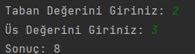
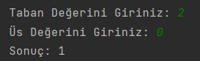
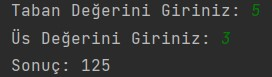

# Recursive Metotlar ile Üslü Sayı Hesaplama
Java dilinde, taban ve üs değerleri kullanıcıdan alınan üs alma işlemini "Recursive" metot kullanarak yapan programı yazınız.

## Senaryo 1

## Senaryo 2

## Senaryo 3
